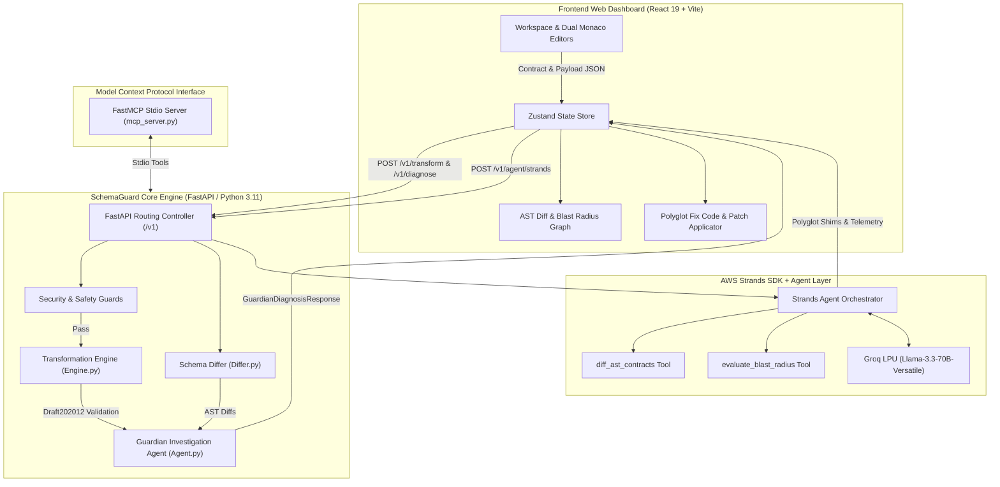

# SchemaGuard — AI-Powered API Contract Guardian

> **Catch API contract drift, missing fields, type mutations, and breaking changes before they break production.**

[](https://fastapi.tiangolo.com/)
[](https://react.dev/)
[](https://www.typescriptlang.org/)
[](https://github.com/aws)
[](https://groq.com/)
[](https://modelcontextprotocol.io/)
[](LICENSE)

---

## 🌐 Live Deployments & Key Links

- **🚀 Interactive Web Application:** [https://ai.studio/apps/90906778-7465-413f-9187-1f416385e66e](https://frontend-henna-iota-76.vercel.app/)
- **⚡ Live Backend API (Render):** [https://schemaguard-api-288s.onrender.com](https://schemaguard-api-288s.onrender.com)
- **📦 GitHub Repository:** [https://github.com/YUG634/SchemaGuard](https://github.com/YUG634/SchemaGuard)

---

## 📌 Executive Summary

In modern microservice architectures, **silent API contract drift** is a leading cause of production outages. When an upstream provider modifies a response payload—by omitting expected keys, altering data types, or introducing breaking structural shifts—downstream consumers fail with unhandled `KeyError` exceptions, `NaN` math propagation, or JSON deserialization crashes.

**SchemaGuard** is an open-source API Contract Guardian. It combines **deterministic AST JSON Schema validation** with **autonomous AI agents powered by AWS Strands SDK and Groq LPU**. SchemaGuard pinpoints schema breaking changes, diagnoses root causes, maps downstream consumer blast radius, and auto-synthesizes backward-compatible remediation code (Pydantic validators for Python and Zod adapters for TypeScript).

```
   OpenAPI Spec + Runtime Payload
                 │
                 ▼
┌─────────────────────────────────┐
│ Deterministic AST Validation    │ ──▶ Prototype Poisoning & Ambiguity Checks
└─────────────────────────────────┘
                 │
                 ▼
┌─────────────────────────────────┐
│ Breaking Change & Diff Detection │ ──▶ Missing Fields, Type Shifts, Value Mismatches
└─────────────────────────────────┘
                 │
                 ▼
┌─────────────────────────────────┐
│ AWS Strands AI Agent (Groq LPU) │ ──▶ Multi-strand Blast Radius & Root Cause Trace
└─────────────────────────────────┘
                 │
                 ▼
┌─────────────────────────────────┐
│ Polyglot Remediation Code       │ ──▶ Python (Pydantic) & TypeScript (Zod) Shims
└─────────────────────────────────┘
```

---

## 🏗️ Architecture & Data Flow

SchemaGuard employs a hybrid architecture: deterministic engines handle low-latency mathematical validation and AST structural diffing, while AI agents orchestrate contextual blast-radius impact analysis and code remediation.



---

## ✨ Key Features & Technical Innovations

### 1. Deterministic AST Validation & Schema Evolution
- **Draft202012 / Draft7 Validation:** Authoritative schema validation utilizing `jsonschema` to capture structural inconsistencies.
- **AST Spec Differ:** Compares baseline vs. candidate OpenAPI/JSON schemas to detect `ADDED_REQUIRED_CONSTRAINT`, `REMOVED_FIELD`, and `TYPE_MUTATION` breaking changes before code deployment.

### 2. Built-in Security & Safety Guards
- **Prototype Poisoning Defense:** Scans nested payloads and schema objects for security exploit keys (`__proto__`, `constructor`, `prototype`), rejecting malicious inputs with HTTP 400.
- **Ambiguous Date Rejection:** Automatically rejects non-deterministic date representations (e.g., `03/04/2026` where both day and month are $\le 12$) with HTTP 422, enforcing ISO-8601 (`YYYY-MM-DD`).

### 3. Currency & Normalization Pipeline
- Automatically strips localized currency symbols (`$`, `₹`, `€`, `£`, `¥`) and commas, converting numeric strings (`"₹1,299"`) into clean Python/JS floats (`1299.0`).

### 4. AWS Strands AI Investigation Agent
- Integrated with **AWS Strands Agents SDK** and **Groq LPU (`llama-3.3-70b-versatile`)** to perform sub-second multi-strand investigation steps:
  1. `AST Invariant Strand`: Executes deterministic AST diff tool.
  2. `Blast Radius Strand`: Assesses consumer risk exposure across system layers.
  3. `Polyglot Remediation Strand`: Synthesizes backward-compatible code patches.
- *Graceful Telemetry Fallback:* Seamlessly falls back to deterministic local analysis if external LLM credentials are omitted or network requests time out.

### 5. Dynamic Downstream Blast-Radius Analysis
- Analyzes violation AST paths to dynamically infer affected downstream microservices (e.g., *Payment Settlement Core*, *Ledger Audit Pipeline*, *Customer Identity Service*, *Inventory Allocation Engine*, *Data Warehouse Lakehouse*).

### 6. Autonomous Polyglot Remediation
- Generates copy-pasteable, production-ready remediation code:
  - **Python:** Pydantic models with `@model_validator(mode='before')` fallback shims.
  - **TypeScript:** Type-safe `zod` adapter schemas with safe defaults.
  - **Unified Diff:** Standardized JSON patch representation.
- **One-Click Patch Applicator:** Apply generated fixes directly back to the workspace contract to verify payload compliance instantly.

### 7. Model Context Protocol (MCP) Server
- Implements `FastMCP` stdio interface (`app/mcp_server.py`), enabling AI assistants (Cursor, Claude Desktop, AutoGen) to invoke SchemaGuard tools directly.

---

## 💻 Tech Stack

| Layer | Technology | Purpose |
|---|---|---|
| **Frontend Framework** | React 19 + Vite 6 | Lightning-fast UI rendering and component architecture |
| **State Management** | Zustand 5 | Global state management across workspace and results |
| **Styling & UI** | TailwindCSS 4 + Lucide Icons | Dark-mode terminal design system with smooth micro-animations |
| **Code Highlighting** | React Syntax Highlighter + JetBrains Mono | IDE-grade code snippet display for Pydantic, Zod, and JSON |
| **Backend Framework** | FastAPI + Uvicorn | Async ASGI Python server powering REST API endpoints |
| **Schema Engine** | `jsonschema` (Draft7 / Draft202012) | Deterministic JSON Schema validation and error AST generation |
| **Agent Framework** | AWS Strands Agents SDK v0.1 | Multi-strand agent workflow orchestration and tool calling |
| **LLM Provider** | Groq LPU (`llama-3.3-70b-versatile`) | Ultra-low latency inference for AI investigation and patch synthesis |
| **Agent Protocol** | FastMCP (Model Context Protocol) | Stdio protocol exposing validation tools to external LLM environments |
| **Test Suite** | Pytest + httpx TestClient | End-to-end unit, integration, safety, and performance testing |
| **Containerization** | Docker | Portable backend production deployment container |

---

## 📂 Repository Structure

```
SchemaGuard/
├── app/                        # FastAPI Backend Application
│   ├── __init__.py
│   ├── main.py                 # FastAPI app entry point & route handlers
│   ├── agent.py                # GuardianInvestigationAgent & Pydantic patch generator
│   ├── strands_agent.py        # AWS Strands Agent SDK + Groq LLM integration & tools
│   ├── engine.py               # TransformationEngine, security guards & normalizers
│   ├── differ.py               # SchemaDiffer for AST OpenAPI baseline vs candidate diffs
│   ├── mcp_server.py           # FastMCP stdio server for AI tool-calling
│   ├── parser.py               # OpenAPI 3.1 document to JSON Schema parser
│   ├── schemas.py              # Pydantic data models for request/response payloads
│   ├── config.py               # Environment configuration settings
│   └── dashboard.html          # Embedded lightweight web dashboard
├── frontend/                   # React 19 + Vite Web Application
│   ├── app/                    # Next.js / API route wrappers
│   ├── src/
│   │   ├── components/
│   │   │   ├── Nav.tsx         # Header navigation bar
│   │   │   ├── Hero.tsx        # Landing page hero & value proposition
│   │   │   ├── Workspace.tsx   # Dual contract/payload JSON editor workspace
│   │   │   ├── Results.tsx     # Diagnostic scorecards, tabs & metrics header
│   │   │   ├── DiffExplorer.tsx# Visual AST tree diff explorer
│   │   │   ├── ImpactFlow.tsx  # Interactive downstream blast-radius consumer graph
│   │   │   ├── FixCode.tsx     # Polyglot remediation code viewer & patch applicator
│   │   │   └── Toast.tsx       # Toast notification overlay
│   │   ├── lib/
│   │   │   ├── store.ts        # Zustand global state store & Strands action handler
│   │   │   ├── analyze.ts      # Multi-endpoint parallel API orchestrator
│   │   │   ├── demo.ts         # Pre-loaded Payment API sample contract & payload
│   │   │   └── types.ts        # TypeScript interface definitions
│   │   ├── App.tsx             # Main application layout
│   │   ├── main.tsx            # React DOM mounting entry point
│   │   └── index.css           # Custom CSS utilities & ambient backdrop grid
│   ├── package.json            # Node.js dependencies & build scripts
│   ├── vite.config.ts          # Vite configuration & server proxy setup
│   ├── tsconfig.json           # TypeScript configuration
│   └── .env.example            # Frontend environment variable template
├── tests/                      # Automated Test Suite
│   ├── __init__.py
│   ├── test_guardian.py        # Tests for SchemaDiffer and Guardian agent
│   ├── test_mcp.py             # Tests for FastMCP tool calls & ambiguity rejection
│   ├── test_safety.py          # Tests for prototype poisoning and date ambiguity security
│   └── test_transformation.py  # Tests for currency normalization and 1MB size limits
├── Dockerfile                  # Container build specification for FastAPI backend
├── requirements.txt            # Python backend dependencies
├── pytest.ini                  # Pytest configuration
├── run_client.py               # Python CLI test script for backend verification
└── .env.example                # Backend environment variable template
```

---

## 🛠️ Developer Setup & Installation

### Prerequisites
- **Node.js** v18+ and **npm** / **bun**
- **Python** 3.11+
- **Git**

---

### 1. Clone the Repository
```bash
git clone https://github.com/YUG634/SchemaGuard.git
cd SchemaGuard
```

---

### 2. Backend Setup (FastAPI)

1. **Create and activate a virtual environment:**
   ```bash
   # Windows (PowerShell)
   python -m venv .venv
   .\.venv\Scripts\Activate.ps1

   # macOS / Linux
   python3 -m venv .venv
   source .venv/bin/activate
   ```

2. **Install Python dependencies:**
   ```bash
   pip install -r requirements.txt
   ```

3. **Configure Environment Variables (Optional):**
   ```bash
   cp .env.example .env
   ```
   *Optional credentials for live LLM inference:*
   ```ini
   GROQ_API_KEY="your_groq_api_key_here"
   AWS_ACCESS_KEY_ID="your_aws_key"
   AWS_SECRET_ACCESS_KEY="your_aws_secret"
   PORT=8000
   HOST=0.0.0.0
   ```

4. **Start the FastAPI Backend Server:**
   ```bash
   uvicorn app.main:app --reload --port 8000
   ```
   *The backend will be available at `http://127.0.0.1:8000`. Access Swagger UI docs at `http://127.0.0.1:8000/docs`.*

---

### 3. Frontend Setup (React / Vite)

1. **Navigate to the `frontend` directory:**
   ```bash
   cd frontend
   ```

2. **Install Node.js packages:**
   ```bash
   npm install
   ```

3. **Configure Frontend Environment (Optional):**
   ```bash
   cp .env.example .env.local
   ```
   *Set `VITE_BACKEND_URL` to point to your local or deployed API:*
   ```ini
   VITE_BACKEND_URL=http://127.0.0.1:8000
   ```

4. **Start the Vite Development Server:**
   ```bash
   npm run dev
   ```
   *The frontend dashboard will be available at `http://localhost:3000`.*

---

### 4. Running Tests

Run the complete Pytest suite to verify backend safety, transformation logic, and MCP tools:

```bash
# From the backend root directory
pytest -v
```

To test backend endpoints via the client CLI helper:
```bash
python run_client.py
```

---

### 5. Running via Docker

To containerize and run the FastAPI backend in Docker:

```bash
# Build Docker image
docker build -t schemaguard-api .

# Run Docker container
docker run -d -p 8000:8000 --env-file .env schemaguard-api
```

---

## 🔌 Model Context Protocol (MCP) Integration

SchemaGuard includes a native **FastMCP** server enabling AI agents to perform schema validation and breaking change detection as standardized tool calls.

### Launching the MCP Server
```bash
python -m app.mcp_server
```

### Exposed MCP Tools

1. `transform_contract(input_data, target_schema, mapping_instructions)`
   - Performs deterministic runtime contract adaptation and currency normalization.
2. `validate_and_diagnose(input_data, target_schema, mapping_instructions)`
   - Validates payloads against schemas and generates diagnostic impact reports.
3. `detect_breaking_changes(baseline_schema, candidate_schema)`
   - Compares baseline vs. candidate schemas to return AST contract diffs.

### Sample Claude Desktop Configuration (`claude_desktop_config.json`)
```json
{
  "mcpServers": {
    "schemaguard": {
      "command": "python",
      "args": ["-m", "app.mcp_server"],
      "cwd": "/path/to/SchemaGuard"
    }
  }
}
```

---

## 📡 Key API Endpoints

### 1. `POST /v1/diagnose`
Validates a JSON payload against an expected OpenAPI schema and provides diagnostic impact scoring.

- **Request Example:**
  ```json
  {
    "contract": {
      "type": "object",
      "properties": {
        "customer_name": { "type": "string" },
        "amount": { "type": "number" }
      },
      "required": ["customer_name", "amount"]
    },
    "payload": {
      "customer_name": "Yug Agrawal"
    }
  }
  ```

- **Response Example (200 OK):**
  ```json
  {
    "status": "violated",
    "violations": [
      {
        "path": "amount",
        "violation_type": "MISSING_REQUIRED_FIELD",
        "expected": "Compliant schema definition",
        "actual": "Mismatched contract payload",
        "message": "'amount' is a required property",
        "severity": "BREAKING"
      }
    ],
    "impact": {
      "summary": "Detected 1 critical contract deviation(s). Immediate consumer breakage risk on 1 execution path(s).",
      "downstream_risks": [
        "Downstream consumers referencing 'amount' will hit unhandled null references or KeyError."
      ],
      "probable_root_cause": "Required field 'amount' is missing from response payload.",
      "recommended_fix": "Ensure service serializer produces 'amount' or relax schema required constraint.",
      "patch_snippet": "from typing import Any, Optional\nfrom pydantic import BaseModel, Field\n\nclass ResolvedContractModel(BaseModel):\n    customer_name: str\n    amount: float"
    },
    "downstream": [
      { "name": "Payment Settlement Core", "severity": "breaking" },
      { "name": "Ledger Audit Pipeline", "severity": "breaking" }
    ],
    "telemetry": { "checked_rules": 2 }
  }
  ```

---

### 2. `POST /v1/diff`
Compares a baseline contract against a candidate contract to identify breaking API changes.

- **Request Example:**
  ```json
  {
    "baseline_contract": {
      "type": "object",
      "properties": { "id": { "type": "string" }, "price": { "type": "number" } },
      "required": ["id"]
    },
    "candidate_contract": {
      "type": "object",
      "properties": { "id": { "type": "string" } },
      "required": ["id", "tax_rate"]
    }
  }
  ```

- **Response Example (200 OK):**
  ```json
  {
    "breaking_change_count": 2,
    "breaking_changes": [
      {
        "path": "required.tax_rate",
        "violation_type": "ADDED_REQUIRED_CONSTRAINT",
        "expected": "Optional or non-existent in baseline",
        "actual": "Required in candidate",
        "message": "New required field 'tax_rate' breaks existing consumers.",
        "severity": "BREAKING"
      },
      {
        "path": "properties.price",
        "violation_type": "REMOVED_FIELD",
        "expected": "Field defined (number)",
        "actual": "None",
        "message": "Field 'price' was removed from target contract.",
        "severity": "WARNING"
      }
    ],
    "risk_level": "HIGH",
    "affected_services": []
  }
  ```

---

### 3. `POST /v1/agent/strands`
Executes multi-strand investigation using AWS Strands SDK and Groq LPU.

- **Request Example:**
  ```json
  {
    "base_contract": { "type": "object", "properties": { "accountId": { "type": "string" } }, "required": ["accountId"] },
    "updated_contract": { "type": "object", "properties": { "legacy_id": { "type": "string" } }, "required": ["legacy_id"] }
  }
  ```

- **Response Example (200 OK):**
  ```json
  {
    "framework": "AWS Strands Agents SDK v0.1",
    "runtime": "Llama-3.3-70B (via Groq LPU)",
    "duration_ms": 689,
    "telemetry": [
      { "step": 1, "strand": "AST Invariant Strand", "action": "diff_ast_contracts", "status": "completed" },
      { "step": 2, "strand": "Blast Radius Strand", "action": "evaluate_blast_radius", "status": "completed" },
      { "step": 3, "strand": "Polyglot Remediation Strand", "action": "synthesize_shims", "status": "completed" }
    ],
    "result": {
      "confidence_score": 0.94,
      "risk_level": "CRITICAL",
      "blast_radius": {
        "affected_consumers": ["BillingWorker", "AnalyticsIngest"],
        "risk_explanation": "Detected 1 schema mutations that may break downstream consumer deserialization."
      },
      "patches": [
        {
          "language": "python",
          "target": "pydantic_validator",
          "code": "@model_validator(mode='before')\ndef shim_missing_fields(cls, data: dict):\n    if 'accountId' not in data:\n        data['accountId'] = data.get('legacy_id', 'UNKNOWN')\n    return data\n"
        },
        {
          "language": "typescript",
          "target": "zod_adapter",
          "code": "import { z } from 'zod';\n\nexport const SafeAdapterSchema = z.object({\n  id: z.string(),\n  accountId: z.string().optional().default('UNKNOWN'),\n  amount: z.number(),\n});\n"
        }
      ]
    }
  }
  ```

---

## 🎬 Demo Workflow

Try the pre-configured Payment API breaking change scenario in the web app:

1. **Load Sample Spec:** Click **"Load Demo Spec"** in the top navigation or workspace header to populate the dual editors with a Payment Orchestration API spec (`v1.4.0`) and a breaking payload (`amount` as string, `signature` as array, missing `settlement_tier`).
2. **Execute Analysis:** Click **"Analyze Schema"** to trigger deterministic validation and diff detection.
3. **Inspect Violations:** Review the severity banner, AST diff tree (`DiffExplorer`), and violation cards highlighting missing required properties and type mismatches.
4. **View Downstream Impact:** Examine the **Impact Flow** component to see affected microservices (*Payment Settlement Core*, *Ledger Audit Pipeline*) dynamically mapped based on broken AST paths.
5. **Review AWS Strands Investigation:** Click **"Investigate with AWS Strands Agent"** to view sub-second execution telemetry traces and blast radius assessments.
6. **Apply Remediation Code:** Toggle between **Python (Pydantic)** and **TypeScript (Zod)** shims, copy or download the files, or click **"Apply to Contract"** to update the workspace contract and confirm compliance.

---

## 🏆 Engineering & Hackathon Value

SchemaGuard addresses a critical gap in API reliability tools:

- **Prevents Debugging Nightmares:** Catches schema drift at the API gateway / CI pipeline level before invalid data pollutes databases or crashes background workers.
- **Deterministic AI Grounding:** Unlike pure LLM tools that hallucinate schema rules, SchemaGuard uses strict AST parsing for validation, leveraging AI exclusively for root cause reasoning and code generation.
- **Zero-Friction Adoption:** Integrates as a standalone web UI, a FastAPI microservice, or an MCP server for AI coding assistants like Cursor and Claude Desktop.
- **Polyglot Developer Experience:** Provides instant, copy-pasteable remediation code for both Python and TypeScript codebases.

---

## 🤝 Contributing

Contributions are welcome! To contribute:

1. Fork the repository.
2. Create a feature branch: `git checkout -b feature/amazing-feature`.
3. Commit your changes: `git commit -m "Add amazing feature"`.
4. Push to the branch: `git push origin feature/amazing-feature`.
5. Open a Pull Request.

---

## 📄 License

This project is licensed under the MIT License — see the [LICENSE](LICENSE) file for details.

---

<div align="center">
  <sub>Built with ❤️ for modern engineering teams preventing API contract drift.</sub>
</div>
